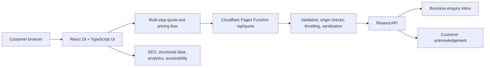
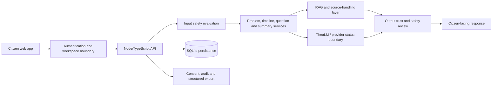
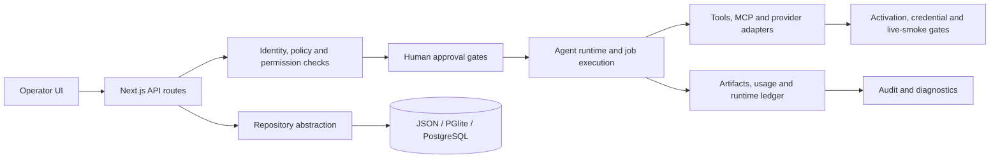
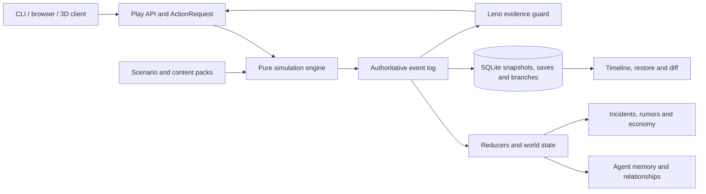

# Interview Cases — Jonas Abde

**Prepared:** 2026-07-11  
**Purpose:** recruiter- and interview-safe explanations of four flagship systems.  
**Rule:** describe the actual product state, personal responsibility, AI-agent contribution, and known limitations. Do not quote test totals, benchmark scores, uptime, conversion, or production-readiness percentages without a fresh verification log.

## How to use this document

For a first interview answer, use the two-minute explanation. For technical follow-up, move through architecture, data flow, risk handling, verification, and known limitations. Keep the distinction clear between:

- product and workflow decisions I owned;
- architecture direction and acceptance criteria I defined;
- code produced or modified with coding-agent assistance;
- review, testing, security, deployment, and operational validation I remained responsible for.

---

# Case 1 — Rendetalje Production Platform

**Best fit:** IT Support, Application Support, Implementation, Technical Operations, practical full-stack, customer-facing systems.

## Two-minute explanation

Rendetalje needed more than a brochure website. The actual business problem was to turn a visitor with an imprecise cleaning need into a structured enquiry that the company could review and answer quickly.

I defined the customer journey, service structure, pricing logic, quote fields, operational requirements, and production priorities. The solution is a React and TypeScript platform deployed through Cloudflare Pages. A multi-step form collects the service type, contact details, location, size, frequency, preferred date, and description. The server-side Cloudflare function validates and sanitizes the request, applies origin and abuse controls, keeps the Resend credential outside the browser, sends the enquiry to the business, and attempts a customer acknowledgement without allowing that secondary email to break the main flow.

My role combines product ownership and technical operations: I translate real customer and administrative problems into requirements, coordinate AI-assisted implementation, review the resulting changes, prioritize security and accessibility fixes, manage deployment direction, and validate the result through daily business use.

The important outcome is not a large repository or a feature count. It is a live system connected to a real service business. The honest limitation is that the current root scripts document TypeScript validation and production build, but not yet a broad automated unit and end-to-end test suite.

## Architecture

## Concrete data flow

1. The customer selects a service and provides structured details.
2. The frontend sends JSON to the quote function.
3. The function accepts only approved origins and POST/JSON requests.
4. It limits payload size, field lengths, request frequency, service types, and obvious spam patterns.
5. User-controlled values are sanitized before they enter HTML email content.
6. The Resend key remains in the Cloudflare runtime environment.
7. The primary business email must succeed for the request to return success.
8. The customer auto-reply is isolated so a secondary failure does not lose the lead.

## Technical risk and how it was addressed

**Risk:** A public enquiry endpoint can be abused for spam, header injection, oversized payloads, cross-origin submission, or HTML injection.

**Controls present in the implementation:**

- allowlisted origins;
- `CF-Connecting-IP` rather than client-controlled forwarded headers for the local throttling key;
- request-rate and body-size limits;
- required-field, length, email, and service-type validation;
- honeypot and simple spam checks;
- HTML escaping of user-provided values;
- CR/LF removal from values used in email subjects;
- server-side environment variables for email credentials;
- explicit 4xx/5xx handling and email timeout.

**Honest technical caveat:** the in-memory throttling map is local to a worker isolate and is not a globally durable rate-limit service. A higher-volume version should use a Cloudflare-native durable or distributed control.

## My defensible responsibility

- Defined the business problem, quote workflow, service content, and acceptance criteria.
- Prioritized customer usability, mobile conversion, accessibility, SEO, and safe form handling.
- Coordinated and reviewed AI-assisted implementation changes.
- Managed production direction and operational validation against real enquiries.
- Identified that automated test breadth is still weaker than the production and business evidence.

## Do not claim

- Do not claim a comprehensive automated test suite until it exists and is freshly run.
- Do not claim conversion improvements without analytics evidence and a defined comparison period.
- Do not describe the platform as a full CRM or complete Rendetalje operating system.

## Likely technical questions

**Why Cloudflare Pages Functions?**  
It keeps the public frontend and a small server-side integration close together, provides a suitable deployment path, and prevents the email credential from being shipped to the browser.

**What would you improve next?**  
Add unit tests for validation and pricing, integration tests for the quote handler with a mocked Resend endpoint, browser E2E coverage for the multi-step form, structured observability, and a distributed rate-limit mechanism.

**What can you debug live?**  
A broken form submission can be isolated across client validation, network payload, Cloudflare function response, environment configuration, Resend response, and the business inbox.

---

# Case 2 — Project Thea

**Best fit:** application support, internal tools, safety-aware products, full-stack, AI-platform operations, regulated or high-trust domains.

## Two-minute explanation

Project Thea explores how a Danish citizen can move from scattered symptoms and health information to a clearer problem statement, timeline, questions, and summary for a healthcare professional. The central product boundary is that it must support preparation and understanding without presenting itself as a doctor, diagnosis tool, medication advisor, or autonomous clinical system.

I worked on the product architecture, requirements, safety boundaries, workflow decomposition, verification gates, and release decisions. The platform combines a React application, a Node/TypeScript API, SQLite persistence, authentication, consent and audit concepts, health-text interpretation, structured export, safety evaluation, and RAG-oriented source handling.

The most important engineering problem is not simply generating text. It is controlling the complete flow. User input is checked for red flags, the response path is constrained by the intended-use boundary, source-grounded behavior is separated from unsupported answers, and generated output is reviewed before it reaches the user. The repository also contains dedicated safety, product, source, trust, prompt-injection, commercial-license, rollout, and release checks.

I describe Thea as an advanced prototype and pilot foundation. Some views and API surfaces are live, but the custom-model track remains R&D, the conversation core is not presented as an autonomous clinical model, and identity, governance, and broader operational launch gates must remain explicit.

## Architecture

## Concrete data flow

1. A user enters a symptom description or health text inside an authenticated workspace.
2. The API evaluates the input against the safety taxonomy before continuing.
3. Emergency or urgent patterns change the response path rather than being treated as a normal chat turn.
4. The system structures symptoms, timelines, questions, cases, or document interpretation depending on the route.
5. RAG-capable flows must preserve source and citation boundaries.
6. Output is checked against diagnosis, medication-change, emergency, and trust constraints.
7. Relevant workspace, consent, and audit information is persisted.
8. The user receives preparation and navigation support—not a diagnosis or treatment decision.

## Technical risk and how it was addressed

**Risk:** A plausible-sounding response can cause harm if it misses urgency, suggests medication changes, invents sources, crosses citizen boundaries, or is mistaken for clinical advice.

**Controls designed into the system:**

- explicit intended-use and non-intended-use definitions;
- red-flag taxonomy and multi-detector safety pipeline;
- safety checks on chat input and output;
- blocks around medication-change requests and suggestions;
- authentication, citizen/workspace ownership, consent and audit concepts;
- RAG truthfulness and source-registry checks;
- prompt-injection, trust-boundary, license, rollout, and release gates;
- clear separation between product paths and experimental custom-model work.

**Honest technical caveat:** tests and safeguards reduce risk but do not turn the platform into a medically validated autonomous system. Clinical, legal, privacy, governance, and pilot evidence remain separate launch requirements.

## My defensible responsibility

- Defined the product goal and strict non-diagnosis boundary.
- Shaped architecture, data flows, safety categories, acceptance criteria, and release gates.
- Decomposed work for coding agents and reviewed implementation and documentation.
- Prioritized security, source trust, prompt-injection resistance, privacy, and deployment posture.
- Kept experimental model claims separate from the shipped product path.

## Do not claim

- Do not call Thea a doctor, diagnostic system, clinically validated AI, or autonomous decision-support product.
- Do not claim the custom model is the default product intelligence without fresh runtime evidence.
- Do not quote historical test totals as current until the full verification run is recorded.

## Likely technical questions

**Why use a rule-based safety layer around AI?**  
Because high-consequence boundaries should not depend only on the same probabilistic component producing the answer. Deterministic rules and evaluation suites provide a separate control and regression surface.

**How do you prevent cross-user data exposure?**  
Authentication alone is insufficient. Every read and write must be constrained by the authenticated citizen/workspace identity, with tests covering ownership and session isolation.

**What would be required before a real pilot?**  
Fresh technical verification, privacy and security review, source and licensing sign-off, operational monitoring, incident procedures, explicit pilot scope, informed consent, feedback handling, and domain-professional review.

---

# Case 3 — FridayOS

**Best fit:** automation, internal tools, technical operations, platform operations, application support, AI-agent governance.

## Two-minute explanation

FridayOS is a governed operations platform for working with AI agents, providers, tools, workspaces, permissions, approvals, runtime jobs, artifacts, usage records, and audit trails.

The problem it addresses is that an agent platform becomes unsafe and difficult to operate if tool access, provider credentials, execution history, human approval, and deployment state are treated as unrelated features. The architecture therefore puts policy and traceability between the user interface and external execution.

I worked on product architecture, requirements, system boundaries, task decomposition, security decisions, verification gates, and release management. Coding agents assisted with implementation, while I remained responsible for deciding which actions require approval, how repository adapters should isolate storage choices, what negative paths must be tested, and what must remain blocked until production configuration and live-provider smoke checks exist.

The platform uses Next.js App Router and API routes, JSON/PGlite/PostgreSQL repository paths, security scanning, negative-path tests, local CI profiles, deployment verification, backup and migration tooling, and provider activation checks. The honest status is an active platform foundation with staged production work—not a universally production-ready operating system.

## Architecture

## Concrete data flow

1. An operator configures or invokes an agent capability.
2. The API resolves identity, workspace, permission, provider, and tool context.
3. Sensitive mutations or external effects are blocked behind policy and approval.
4. Runtime execution records jobs, artifacts, usage, and ledger events.
5. Storage is accessed through a repository boundary rather than UI-specific persistence.
6. Provider access depends on credentials, activation state, readiness, and live-smoke evidence.
7. Diagnostics and audit views expose what happened and why.

## Technical risk and how it was addressed

**Risk:** An agent may execute an external action with the wrong identity, provider, credential, permission, or approval state—and leave too little evidence to investigate it.

**Controls and design decisions:**

- explicit approval and permission boundaries;
- negative-path and security tests;
- provider-specific readiness and smoke checks;
- encrypted token-store and refresh-token handling paths;
- activation blocked until required production configuration exists;
- runtime jobs, artifacts, usage records, ledgers, backups, and diagnostics;
- local/release CI profiles because absence of hosted GitHub checks is not treated as success;
- read-only-first posture for new workspace capabilities.

**Honest technical caveat:** production secrets, real-provider smoke checks, tracked asset verification, and production deploy evidence are environment-specific. Those gates must be freshly closed before calling the Marketplace or the broader platform fully shipped.

## My defensible responsibility

- Defined platform scope, governance requirements, approval boundaries, and release criteria.
- Directed work across agent workspace, Marketplace, providers, repository adapters, runtime records, and deployment verification.
- Reviewed AI-assisted code and documentation for contradictions, missing gates, and unsafe claims.
- Required explicit remaining-work documents instead of treating merged code as production proof.

## Do not claim

- Do not call every provider integration production-active without live-smoke evidence.
- Do not claim hosted CI success when no current status check exists.
- Do not present asset completeness or full Marketplace ship as complete until its release gates are recorded.

## Likely technical questions

**Why use repository adapters?**  
They separate domain behavior from a particular persistence engine, making it possible to test logic against simpler stores and move production paths toward PostgreSQL without coupling every route to storage details.

**Why are approval records separate from permissions?**  
Permission answers whether an actor may request an action. Approval records whether a particular high-impact execution was reviewed and authorized in its actual context.

**How would you debug a failed tool execution?**  
Trace identity and workspace, permission decision, approval state, provider activation, credential status, readiness/smoke result, job record, adapter response, artifact output, and ledger/audit events.

---

# Case 4 — WorldMind Core

**Best fit:** backend and systems reasoning, TypeScript, deterministic simulation, data contracts, testing and validation, game/simulation infrastructure.

## Two-minute explanation

WorldMind is a simulation-first engine for a small near-future district. Instead of treating each NPC as an isolated chatbot, it models agents with goals, memories, relationships, permissions, actions, rumors, economy, incidents, and evidence.

The core architectural decision is that the authoritative event log is the system truth. Agent memory is an interpretation of events, not a replacement for them. Hidden story truth cannot be exposed merely because the model or content knows it; the player or companion needs evidence.

I worked on simulation and product design, system boundaries, data contracts, deterministic requirements, feature decomposition, validator design, and AI-assisted implementation review. The system includes a pure simulation layer, play API and browser interfaces, SQLite save/branch/timeline persistence, scenario and content packs, a browser authoring tool, and custom validators for state, events, risks, content, assets, and releases.

The most important engineering proof is not the number of NPCs or historical test totals. It is the deterministic model: the same inputs should produce reproducible outcomes; a snapshot can be restored and branched; differences can be inspected; and the Leno companion must not reveal hidden causes without evidence. The public repository is technically inspectable, but its README contains historical clutter and the default test command skips selected patterns, so current totals must come from `test:all` and the release gate.

## Architecture

## Concrete data flow

1. A player command becomes a typed/validated action request.
2. Permission and risk rules determine whether the action may execute.
3. The pure simulation engine emits authoritative events.
4. Reducers derive world state, relationships, memories, rumors, economy, and incidents.
5. Saves persist snapshots and origin/branch metadata in SQLite.
6. Restore and diff workflows reproduce and compare timelines.
7. Leno may use observed evidence but must not leak hidden truth.
8. Browser, CLI, dashboard, 3D, and authoring surfaces consume the same underlying contracts.

## Technical risk and how it was addressed

**Risk:** A complex agent world becomes impossible to debug when UI state, model memory, story truth, and persistence all act as competing sources of truth.

**Controls and architecture:**

- a pure simulation core separated from I/O;
- authoritative, typed event payloads;
- scenario, action, risk, state, event-log, and content validation;
- deterministic double-run and event-log diff checks;
- save, restore, branch, timeline, and structured snapshot diff;
- explicit evidence guard for hidden truth;
- audit and secret-leakage tooling;
- release verification separate from the default test command.

**Honest technical caveat:** generated content and many validators can create a large apparent test surface. A fresh `npm run test:all`, `npm run ci:gate`, and `npm run release:verify` is required before quoting counts or declaring a release clean.

## My defensible responsibility

- Defined the simulation-first concept and separation between truth, memory, evidence, and presentation.
- Directed data contracts, deterministic behavior, save/branch requirements, and release validators.
- Decomposed implementation across engine, play layer, persistence, authoring, assets, and QA.
- Reviewed and corrected AI-assisted work to preserve invariants and a coherent architecture.

## Do not claim

- Do not present historical README test numbers as a fresh result.
- Do not claim the repository is a finished commercial game.
- Do not describe the agents as general intelligence; they are bounded simulation actors.

## Likely technical questions

**Why an event log instead of directly mutating state?**  
It provides traceability, deterministic replay, debugging, branch comparison, and a defensible source of truth for derived state.

**How does evidence gating work conceptually?**  
Hidden truth exists in authored/system state, but a user-facing component may only reveal it when an observed event or evidence record authorizes that knowledge path.

**What would you improve next?**  
Reduce README/history clutter, make the public/license status consistent, simplify the verification surface, strengthen profiling and long-run simulation tests, and create a concise playable demo with one canonical architecture walkthrough.

---

# Cross-project answer: How I use AI coding agents

A concise interview answer:

> I use coding agents as implementation collaborators, not as a substitute for responsibility. I define the problem, requirements, architecture direction, boundaries, and acceptance criteria. I break work into reviewable changes, inspect diffs, run or require tests and security checks, resolve contradictions, and decide whether something is safe to merge or deploy. I am transparent that I did not manually type every line. My evidence is that I can explain the system, trace a data flow, identify its limitations, reproduce its verification steps, and change or debug it.

# Cross-project answer: My strongest professional direction

> My strongest fit is where users, operations, and software meet: IT Support, Application Support, Technical Operations, Implementation, Automation, and internal tools. I bring enterprise support exposure, real small-business operational responsibility, and hands-on experience shaping and operating software systems.